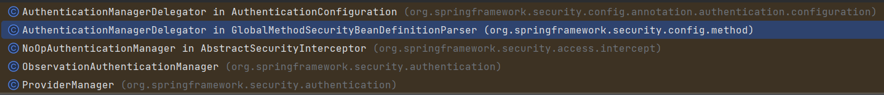
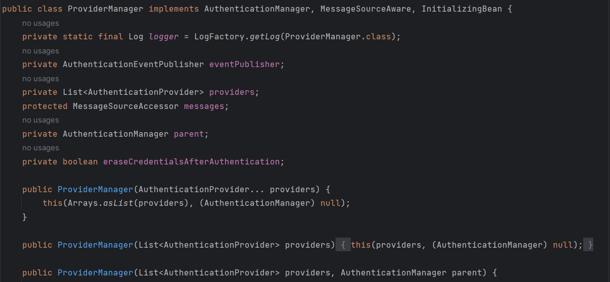
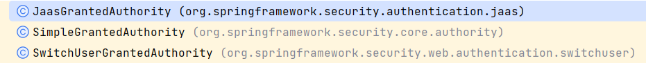

# Spring-Security

## Prerequisite
    JDK Corretto-21
    Maven 3.5+

## Tech Stack
    Java 21
    Maven 3.5+
    SpringBoot 3.3.0
    Spring Data Jpa   
    H2 Database
    Lombok
    Spring Security
    Jwt
    SpringBoot Validation

## Config
Database: 
```yaml 
Spring:
    jpa:
        database-platform: org.hibernate.dialect.H2Dialect (config in jpa level, Specified type db for hibernate)```
        properties:
            hibernate:
                dialect: org.hibernate.dialect.H2Dialect (Config in hibernate level, overriding database-platform, direct indication for hibernate)
```
=> This parameter is typically used to automatically determine the appropriate Dialect (grammar) based on the connected database. 
[Reference](https://medium.com/@humbleCoder007/configuring-h2-database-in-a-spring-boot-application-3c5b1ec49189#id_token=eyJhbGciOiJSUzI1NiIsImtpZCI6ImMzYWJlNDEzYjIyNjhhZTk3NjQ1OGM4MmMxNTE3OTU0N2U5NzUyN2UiLCJ0eXAiOiJKV1QifQ.eyJpc3MiOiJodHRwczovL2FjY291bnRzLmdvb2dsZS5jb20iLCJhenAiOiIyMTYyOTYwMzU4MzQtazFrNnFlMDYwczJ0cDJhMmphbTRsamRjbXMwMHN0dGcuYXBwcy5nb29nbGV1c2VyY29udGVudC5jb20iLCJhdWQiOiIyMTYyOTYwMzU4MzQtazFrNnFlMDYwczJ0cDJhMmphbTRsamRjbXMwMHN0dGcuYXBwcy5nb29nbGV1c2VyY29udGVudC5jb20iLCJzdWIiOiIxMTAzMzE0NjExMTA0NzEzNTQ4MTYiLCJlbWFpbCI6ImhvYW5ndnV2YW42NzdAZ21haWwuY29tIiwiZW1haWxfdmVyaWZpZWQiOnRydWUsIm5iZiI6MTcxODYxMzQ0MSwibmFtZSI6Ikhvw6BuZyBWxakgdsSDbiIsInBpY3R1cmUiOiJodHRwczovL2xoMy5nb29nbGV1c2VyY29udGVudC5jb20vYS9BQ2c4b2NMRWxQREh1ck5heEtPU08tNUxnUzU4RjJ5R0lUVkF0WU9odWQwSnROWG53SGJtcHZKaj1zOTYtYyIsImdpdmVuX25hbWUiOiJIb8OgbmciLCJmYW1pbHlfbmFtZSI6IlbFqSB2xINuIiwiaWF0IjoxNzE4NjEzNzQxLCJleHAiOjE3MTg2MTczNDEsImp0aSI6ImQ5NzQ1ZGE5NGQyODJmMGI2ZmE5OWMzYjlhNDBhOWZhZTU3M2Y1ZGQifQ.DDujE-f5ElJk_sVDc7uOS14zoH3w-tQ58lr2O65OuQMHjYtJePJsDexrx_SqQODGvM9fkOULMeSqZEqS0J2yeNM6iK1niacKSzp7vAX8uJIwAHVgL2CwjLeha2Yd0zvTJfgfBTlOKhf33GReib671WYHWLIGA_8owtdFgtyV3YAdef1AgD84iF3HTaDGJ40H1HI51iCeQgnazfVtrVrDDz12-di0b3hSdGMreJ9jEsqBNdJhFVFgVtS4-hklmEU0I_LwG7uhuj6JdhoeNRzYc1APLkf9BjP6Rs5EwXCHsbzUIHaMw7rrJ9_7aEeLNVIY0hCkNCDlfyYzfxGrRMdVOQ)

```yaml
  h2:
    console:
      enabled: true
      path: /h2
```
=> show h2 database with path http://localhost:8080/h2

## Architecture Of Security
[Docs](https://docs.spring.io/spring-security/reference/servlet/architecture.html)
[Medium docs](https://medium.com/@rasheed99/introduction-on-spring-security-architecture-eb5d7de75a4f)
[Other docs](https://magz.techover.io/2023/01/02/spring-security-tim-hieu-ve-internal-flow/)

## WorkFlow


## Diễn giải, tiếng việt
* Giới thiệu
    - Thông thường, trong Spring MVC hay SpringBoot , tất cả các Http request gửi đến sẽ được chuyển qua một "Servlet" 
    duy nhất được gọi là "DispatcherServlet". Servlet sẽ điều hướng các request này tới các controller (endpoints).
    - Về cốt lõi Spring Security là chuỗi (chains) các bộ lọc (Filter) được thêm vào trước khi các request đến được
    "DispatcherServlet".
    -> Tất cả các request được gửi đến sẽ phải đi qua các filter. Các tiếp cận này giúp xác minh (authentication) cũng 
    như phân quyền (authorization) các request trước khi đi qua "DispatcherServlet" và cuối cùng là các Controller (endpoints).
        
### Luồng đi của request khi có Spring Security


### Thành phần kiến trúc
#### "Security Filter Chain" (Nơi đầu tiên tiếp nhận các request để xử lý)
* Mô tả:
    - Một loạt các bộ lọc sẽ xử lý các http request bằng cách liên lạc với "Authentication Manager" để xác thực các yêu cầu.
    - Các Filter này sẽ hoạt động cùng nhau để đảm bảo ứng dụng web được an toàn và sẽ làm nhiệm vụ như xác thực, phân quyền,
    và quản lý phiên ...
    - Các bộ Filter này sẽ được áp dụng theo thứ tự nhất định vì mỗi bộ lọc sẽ chịu trách nhiệm về một khía cạnh bảo mật 
    cụ thể.
* Các Filter mặc định
    Spring Security Authentication Filters là những filter sẽ nằm giữa client request với server. Khi nhận được
    request, các filter sẽ tách lọc những thông tin từ request thành các authentication details (username, password,
    roles,…). Default Spring Security sẽ sử dụng class UsernamePasswordAuthenticationFilter.

    - ChannelProcessingFilter: đảm bảo rằng các request là HTTP hoặc HTTPS
    - SecurityContextPersistenceFilter: đảm bảo các thông tin chi tiết xác thực của người dùng (user’s authentication details)
    vẫn tồn tại trong phiên của họ.
    - UsernamePasswordAuthenticationFilter: Kiểm tra thông tin đăng nhập được cung cấp như userName/password và tạo
    một "Authentication Object" nếu thông tin đăng nhập hợp lệ. (Authentication object sẽ là class UsernamePasswordAuthenticationToken.)
    - ConcurrentSessionFilter: Kiểm soát số lượng session mà một người dùng có thể có đồng thời xử lý tình huống 
    session vượt quá số lượng cho phép.
    - LogoutFilter: Chặn các yêu cầu đăng suất và loại bỏ, chấm dứt session của user.
    - RememberMeAuthenticationFilter: cho phép ghi nhớ user qua các session ngay cả khi đã logout.
    - AnonymousAuthenticationFilter: chịu trách nhiệm tạo người dùng ẩn danh (anonymous) không được xác thực nhưng
    có quyền truy cập hạn chế vào một số phần của ứng dụng.
    - SessionManagementFilter: quản lý session và các tác vụ khác liên quan đến session.
    - ExceptionTranslationFilter: chuyển các Exception thành các unauthenticated exception.
    - FilterSecurityInterceptor : đảm bảo user có các role và permission cần thiết để truy cập tài nguyên.

[Tham khảo thêm về "Filter Chain"](https://docs.spring.io/spring-security/site/docs/3.0.x/reference/security-filter-chain.html)

* Method Filter Chain
```java
@Bean
public SecurityFilterChain securityFilterChain(HttpSecurity httpSecurity) {
    httpSecurity.authorizeHttpRequests(authorize -> authorize
            .requestMatchers("/signup/").permitAll()
            .requestMatchers("/users").authenticated()
    ).httpBasic(Customizer.withDefaults());
    return httpSecurity.build();
}
``` 
Một ví dụ đơn giản cho cấu hình "Security Filter Chain", cho phép truy cập không giới hạn với url "/signup", trong 
khi đó yêu cầu xác thực với url "users".

Một cấu hình khác:
```java
@Bean
public SecurityFilterChain filterChain(HttpSecurity http) throws Exception {
    http.cors().and()
            .csrf(csrf -> csrf.disable())
            .exceptionHandling(exception -> exception.authenticationEntryPoint(unauthorizedHandler))
            .sessionManagement(session -> session.sessionCreationPolicy(SessionCreationPolicy.STATELESS))
            .authorizeHttpRequests(auth ->
                    auth.requestMatchers("/open/**").permitAll()
                            .anyRequest().authenticated()
            )
            .authenticationProvider(authenticationProvider())
            .addFilterBefore(authenticationJwTokenFilter(), UsernamePasswordAuthenticationFilter.class);
    return http.build();
}
```
* Các cấu hình được định nghĩa
  * .cors().and(): cấu hình chia sẻ tài nguyên chéo
  * .csrf(csrf -> csrf.disable()): vô hiệu hóa "CSRF", cấu hình này được sử dụng khi xác thực bằng JWT
  * .exceptionHandling(exception -> exception.authenticationEntryPoint(unauthorizedHandler)): xử lý cấu hình khi truy
  cập bị từ chối.
  * .sessionManagement(session -> session.sessionCreationPolicy(SessionCreationPolicy.STATELESS)): chương trình sẽ không
  tạo và sử dụng HTTP Session để bảo mật.
  * .authorizeHttpRequests(auth -> auth.requestMatchers("/open/**").permitAll().anyRequest().authenticated()): các request
  với url "/open/**" không cần xác thực, còn mọi url khác đều yêu cầu xác thực.
  * .authenticationProvider(authenticationProvider()): Khai báo một "AuthenticationProvider" đã được triển khai với 
  "DaoAuthenticationProvider" hoặc bất kỳ implement nào sẽ được sử dụng để xác thực.
  * .addFilterBefore(authenticationJwTokenFilter(), UsernamePasswordAuthenticationFilter.class): chèn một Filter tùy 
  chỉnh, Filter này trước khi các logic khác của "Filter Chain" được thực hiện. Đây là cách triển khai chung cho JWT.

#### Authentication Manager
* Mô tả:
  * Authentication Manager là một interface với authenticate() method, nó là thành phần trung tâm xác thực user.
    Nó điều phối quá trình authen và ủy quyền xác thực cho "Authentication Provider".
  * Trong một số hệ thống phức tạp thì mỗi "Authentication Manager" có thể liên kết với một nhóm các "Provider" 
    cho phép xử lý các loại xác thực khác nhau cho các thành phần khác nhau của ứng dụng.
  * Authentication Manager có 5 implement nhưng Behavior mặc định được sử dụng để authen là "Provider Manager":

    * AuthenticationManagerDelegator: class này có tác dụng ủy quyền việc xác thực cho một "Authentication 
    Manager" khác, nó hữu ích cho các trường hợp cần tách biệt hoặc chuyển hướng quy trình xác thực dựa trên
    ngữ cảnh cụ thể.
    * NoOpAuthenticationManager: là triển khai không thực hiện bất kỳ thao tác xác thực nào. Nó có thể được sử dụng cho
    mục đích kiểm thử hoặc khi cần một "Authentication Manager" mà không có logic xác thực thực tế.
    * ObservationAuthenticationManager: được sử dụng để quan sát và ghi lại các xự kiện xác thực, hữu ích cho việc theo
    dõi và kiểm tra quá trình xác thực. Giúp cải thiện bảo mật cũng như phát hiện các hành vi bất thường.
    * ProviderManager: là triển khai phổ biến nhất của "Authentication Manager". Nó quản lý một danh sách các
    "Authentication Provider" và sử dụng chúng để thực hiện việc xác thực.
      * ProviderManager duy trì một danh sách các "AuthenticationProvider". Khi một yêu cầu xác thực được nhận, 
      "ProviderManager" sẽ tuần tự kiểm tra từng "AuthenticationProvider" cho đến khi tìm thấy một nhà cung cấp 
      có thể xử lý yêu cầu đó.
      * AuthenticationProvider sẽ thử xác thực thông tin xác thực. Nếu thành công, nó sẽ trả về một đối tượng 
      "Authentication" đã được xác thực. Nếu tất cả các nhà cung cấp thất bại, "Provider Manager" sẽ ném ra một 
      ngoại lệ xác thực (AuthenticationException).


#### Authentication Provider 
* Mô tả:
  * Authentication Provider là interface với authenticate() method, các implement của nó có nhiệm vụ xử lý logic liên 
  quan đến xác thực, phục vụ cho "Authentication Manager".
  * Authentication Provider có nhiều triển khai:
    * DaoAuthenticationProvider: sử dụng "UserDetailService" để truy xuất thông tin chi tiết của user từ database
    và so sánh thông tin xác thực.
    * LdapAuthenticationProvider: sử dụng để xác thực với LDAP server.
    * JwtAuthenticationProvider: sử dụng để xác thực Jwt token của user.
    * CustomAuthenticationProvider: xác thực bằng logic cụ thể hoặc với hệ thống bên ngoài.
```java
@Bean
public DaoAuthenticationProvider daoAuthenticationProvider() {
    DaoAuthenticationProvider daoAuthenticationProvider = new DaoAuthenticationProvider();
    daoAuthenticationProvider.setUserDetailsService(userDetailsService());
    daoAuthenticationProvider.setPasswordEncoder(passwordEncoder());
    return daoAuthenticationProvider;
}
```
    - Trong đoạn mã này DaoAuthenticationProvider được khởi tạo, cấu hình với:
        + userDetailsService(): method trả về user detail được truy vấn
        + passwordEncoder(): để băm và xác thực mật khẩu

* UserDetailService
  * Là một interface lấy thông tin chi tiết của user trong quá trình xác thực. Nó được sử dụng trong "Authentication 
  Provider" để lấy thông tin chi tiết về user cần xác thực từ cơ sở dữ liệu.
  * Cách triển khai UserDetailService:
```java
//Triển khai thông qua class impl, overrides the loadUserByUsername
public class UserDetailsServiceImpl implements UserDetailsService {
    @Autowired
    public UserRepository userRepository;

    @Override
    public UserDetails loadUserByUsername(String username) throws UsernameNotFoundException {
        Optional<User> user = userRepository.findById(username);
        if (user.isEmpty()) {
            throw new UsernameNotFoundException("user not found with this username");
        }

        return new UserDetailsImpl(user.get());
    }
}
```
```java
//Triển khai thông qua biểu thức Lambda, "Funtional Interface"
@Configuration
@RequiredArgsConstructor
public class ApplicationConfig {
    private final UserRepository userRepository;

    @Bean
    public UserDetailsService userDetailsService() {
        return username -> userRepository.findByEmail(username).orElseThrow(() -> new RuntimeException("User not found"));
    }
}
```
* Password Encoder
  * Là interface để encode, decode, hash và xác thực mật khẩu
  * Các triển khai của "Password Encoder":
    * BCryptPasswordEncoder là lựa chọn để hash mật khẩu một cách an toàn, nó có nhiều ưu điểm như:
      * Salt tự động: BCryptPasswordEncoder tự động tạo ra một salt ngẫu nhiên cho mỗi mật khẩu. Điều này đảm bảo rằng 
      ngay cả khi hai người dùng có cùng một mật khẩu, các hash được tạo ra sẽ khác nhau. Điều này giúp bảo vệ chống 
      lại các cuộc tấn công từ điển và rainbow table.
      * Khả năng điều chỉnh độ khó: BCryptPasswordEncoder cho phép điều chỉnh tham số chi phí (cost factor), làm cho 
      quá trình băm chậm hơn và do đó khó khăn hơn cho kẻ tấn công để phá vỡ mật khẩu bằng cách brute force.
      * An toàn trước các cuộc tấn công: Bcrypt được thiết kế để bảo vệ chống lại nhiều loại tấn công, bao gồm brute 
      force, từ điển và rainbow table. Do sử dụng hàm băm Blowfish, bcrypt cung cấp một mức độ bảo mật cao cho mật 
      khẩu người dùng.
    * NoOpPasswordEncoder: bộ mã hóa này không thực hiện bất kỳ thao tác băm hay mã hóa nào, mật khẩu sẽ được lưu dưới
    dạng văn bản thuần túy. Không an toàn cho bảo mật.
    * StandardPasswordEncoder là một encoder trong Spring Security sử dụng thuật toán băm SHA-256 với một salt cố định:
    * Thuật toán băm SHA-256: StandardPasswordEncoder sử dụng thuật toán băm SHA-256 kết hợp với một salt để băm mật khẩu.
      * Salt cố định: Mặc dù có sử dụng salt, nhưng salt được sử dụng bởi StandardPasswordEncoder không thay đổi và 
      * không được tự động tạo ra một cách ngẫu nhiên cho mỗi mật khẩu. Điều này làm giảm tính bảo mật vì mật khẩu băm
      có thể dễ dàng bị tấn công hơn nếu kẻ tấn công biết salt cố định.
      * Thiếu khả năng điều chỉnh độ khó: Không giống như bcrypt hoặc scrypt, StandardPasswordEncoder không có khả năng 
      điều chỉnh độ khó của thuật toán băm, điều này làm giảm hiệu quả của nó trước các cuộc tấn công brute force khi 
      phần cứng trở nên mạnh mẽ hơn.
    * SCryptPasswordEncoder là một lựa chọn tốt cho việc băm mật khẩu một cách an toàn. SCrypt là một thuật toán băm 
    mật khẩu được thiết kế để tăng khả năng chống lại các loại tấn công nhất định, đặc biệt là những tấn công có sử 
    dụng phần cứng như GPU hoặc ASIC. Đặc điểm chính của SCrypt là nó yêu cầu một lượng bộ nhớ lớn hơn so với các thuật 
    toán khác như bcrypt hay PBKDF2, điều này làm cho việc tấn công brute-force trở nên đắt đỏ và khó khăn hơn nhiều.
```java
@Bean
public PasswordEncoder passwordEncoder() {
    return new BCryptPasswordEncoder();
}
```
* UserDetails
  * Nó thể hiện các chi tiết chính của user, bao gồm username, password và authorities.
  * Spring Security sử dụng "UserDetails" để lưu trữ thông tin về user được xác thực.
```java
public interface UserDetails extends Serializable {
    Collection<? extends GrantedAuthority> getAuthorities();

    String getPassword();

    String getUsername();

    boolean isAccountNonExpired();

    boolean isAccountNonLocked();

    boolean isCredentialsNonExpired();

    boolean isEnabled();
}
```

#### SecurityContextHolder and Principal
* Mô tả:
  * SecurityContextHolder quản lý "Security context" của user trong suốt "Request-Response LifeCycle". Nó lưu trữ
  thông tin của user được xác thực như role hoặc các thông tin xác thực khác.
  * Khi user được xác thực thành công "Spring Security" sẽ tạo ra các "Authentication Object" và được "SecurityContextHolder"
  quản lý.
```java
Authentication authentication = SecurityContextHolder.getContext().getAuthentication();
String username = authentication.getName();
```
  * Principal đại diện cho username, authorities và các dữ liệu cụ thể khác của user.


### Request & Response lifecycle


* Luồng
  * B1: Request đến bị chặn bởi "SecurityFilterChain", nơi bao gồm một loạt các Filter, mỗi Filter có nhiệm vụ bảo mật
  cụ thể.
  * B2: Nếu user chưa được xác thực (chưa đăng nhập), các Fliter sẽ kích hoạt trình quản lý xác thực. Nếu thông tin 
  đăng nhập hợp lệ, một Authentication object sẽ được tạo ra.
  * B3: AuthenticationManager sử dụng "AuthenticationProvider" để xác minh thông tin user.
  * B4: AuthenticationProvider sử dụng "PasswordEncoder" để lưu trữ và so sánh mật khẩu.
  * B5: AuthenticationProvider sử dụng UserDetailService lấy thông tin chi tiết của user, thông tin lấy được sẽ được 
  so sánh với thông tin cần xác thực được đưa vào.
  * B6: UserDetailService lấy dữ liệu user cần xác thực từ Database.
  * B7: Trạng thái xác thực sẽ được gửi tới người dùng dưới dạng "success response" hoặc "anauthorized response".
  * B8: Authentication object được tạo ra sẽ được lưu trữ trong "Security Context" quản lý bởi "SecurityContextHolder"
  

### JWT 
[Reference Spring Security JWT](https://medium.com/@dilankacm/spring-security-architecture-explained-with-jwt-authentication-example-spring-boot-5cc583a9aeac)
[Other](https://dev.to/m1guelsb/authentication-and-authorization-with-spring-boot-4m2n)
* GrantedAuthority
  * Đại diện cho một quyền (role - authorities) được cấp cho người dùng.
  * Quyền thường là các vai trò hoặc quyền giúp xác định xem những thao tác mà user có thể thực hiện.
  * Implement của nó được sử dụng thường xuyên là "SimpleGrantedAuthority".


* UserNamePasswordAuthenticationToken
  * Là class đại diện cho "Authentication" dựa trên username và password được truyền vào và lưu trữ dưới object
  principal và credentials. Nó là implement của "Authentication Interface" - (đối tượng sẽ được lưu trữ trong context).

